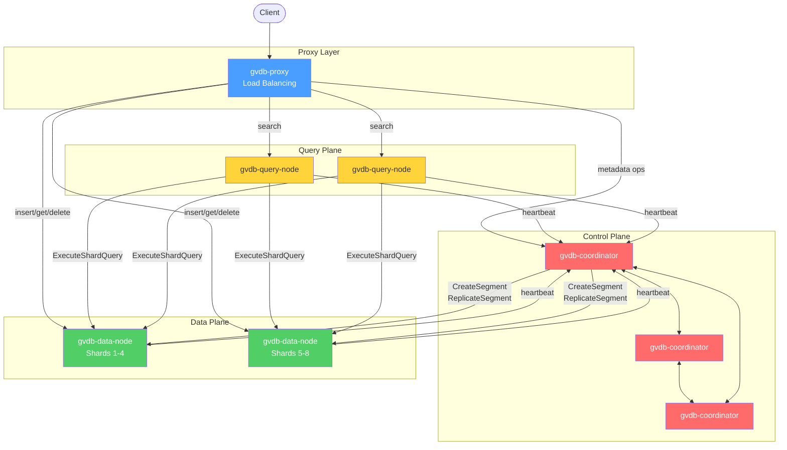

# GVDB - Distributed Vector Database

A high-performance distributed vector database written in C++ for similarity search at scale.

Store, index, and search high-dimensional vectors (embeddings from OpenAI, Cohere, HuggingFace, etc.) with sub-millisecond latency. Use it to power semantic search, recommendation engines, RAG pipelines, image retrieval, and anomaly detection.

## Features

- **Vector Search**: FLAT, HNSW, IVF_FLAT, IVF_PQ, IVF_SQ index types via Faiss
- **Distributed Mode**: Coordinator, data nodes, query nodes, proxy with full sharding and replication
- **Multi-Shard Collections**: Data distributed across nodes with consistent hashing
- **Fault Tolerance**: Automatic failure detection, replica promotion, auto-replication
- **Metadata Filtering**: SQL-like filters (`age > 18 AND city = 'NYC'`, `LIKE`, `IN`)
- **Persistence**: Vectors flushed to disk, index rebuilt on startup recovery
- **gRPC API**: Protobuf-based client/server with TLS and API key authentication
- **Raft Consensus**: Metadata operations replicated via NuRaft

## Architecture



| Binary | Role |
|--------|------|
| `gvdb-single-node` | All-in-one for development and small deployments |
| `gvdb-coordinator` | Cluster metadata via Raft consensus |
| `gvdb-data-node` | Sharded vector storage and indexing |
| `gvdb-query-node` | Distributed search with fan-out and result merging |
| `gvdb-proxy` | Client entry point with load balancing |

## Quick Start

Requires C++20 (GCC 11+ / Clang 14+) and CMake 3.15+. All other dependencies are fetched automatically.

```bash
cmake -S . -B build -DCMAKE_BUILD_TYPE=Release
cmake --build build -j$(nproc)

# Single-node
./build/bin/gvdb-single-node --port 50051 --data-dir /tmp/gvdb
```

## Tests

```bash
ctest --test-dir build --output-on-failure
```

```
test/
├── unit/           # C++ unit tests (Google Test)
├── integration/    # Multi-component distributed tests
└── e2e/            # End-to-end tests (Go)
```

## License

Apache License 2.0 - see [LICENSE](LICENSE)
