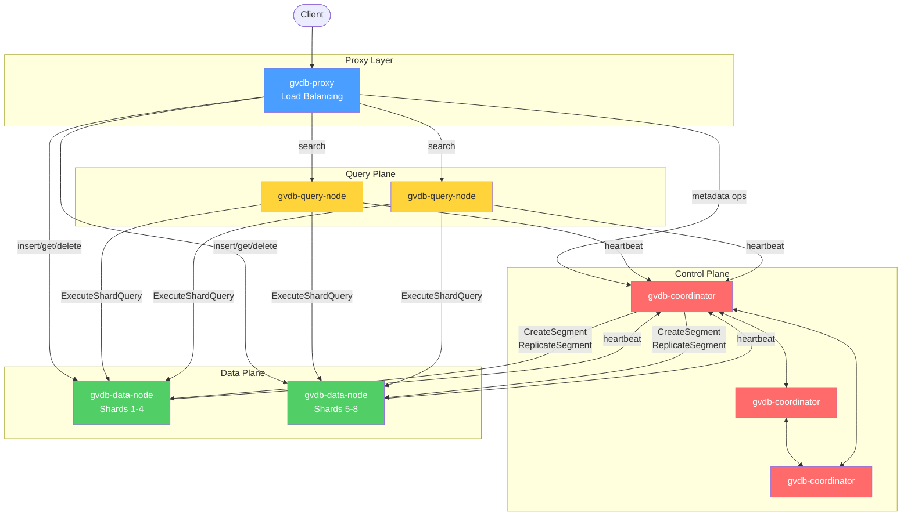

# Architecture overview

GVDB separates **control plane** (coordinators), **data plane** (data nodes), **query plane** (query nodes), and **proxy** (client entry point). Each role scales independently.

## Topology



## Binaries

| Binary | Role | Scales with |
|--------|------|-------------|
| `gvdb-single-node` | All-in-one for development and small deployments | Not applicable |
| `gvdb-coordinator` | Cluster metadata via Raft consensus | Fixed at 3 (quorum) |
| `gvdb-data-node` | Sharded vector storage and indexing | Storage and insert throughput |
| `gvdb-query-node` | Distributed search with fan-out and result merging | Query QPS |
| `gvdb-proxy` | Client entry point with load balancing | Connection count |

## Data plane

- Vectors live in **segments** (GROWING → SEALING → SEALED → FLUSHED).
- Each collection is sharded across data nodes via **consistent hashing** (150 virtual nodes per shard).
- Sealed segments flush to **local disk** and optionally to [S3/MinIO](../features/tiered-storage.md).
- Indexes are **rebuilt from vectors on startup** — the on-disk format is stable across index-type migrations.

See [Architecture — storage](storage.md).

## Control plane

- **NuRaft** powers metadata replication: collection definitions, shard assignments, node membership.
- **Timestamp oracle** (TSO) provides total ordering for distributed operations.
- **Persistent log** lives in **RocksDB** on each coordinator.

See [Architecture — consensus](consensus.md).

## Query plane

- Query nodes receive a search request, **fan out** to the data nodes holding the relevant shards, and **merge** top-k lists.
- **LRU result cache** (FNV-1a hash, collection-version invalidation) fronts the query node for repeated queries.

## Proxy

- Routes writes to the **primary replica** of the target shard.
- Routes reads to any healthy **query node**.
- Does **not** hold state; horizontally scalable.

## Module dependency graph

```
Layer 0 (Foundation):
  core/ → (no dependencies)

Layer 1 (Infrastructure):
  utils/    → core
  consensus/→ core
  auth/     → core, utils
  index/    → core
  network/  → core, auth

Layer 2 (Storage/Compute):
  storage/  → core, index
  compute/  → core, index

Layer 3 (Orchestration):
  cluster/  → core, consensus, storage, compute, network
```

See [Architecture — modules](modules.md) for per-module detail.

## Reliability

- **Replication**: segments replicate over gRPC; coordinator auto-replicates under-replicated shards.
- **Failure detection**: heartbeats from data/query nodes to coordinators; unresponsive nodes are marked dead.
- **Promotion**: replicas promote to primary automatically on failure.
- **Read repair**: background sweep reconciles replicas after recovery.

## Related

- [Distributed cluster](../getting-started/distributed-cluster.md) — walkthrough
- [Modules](modules.md) — code organization
- [Consensus](consensus.md) — Raft details
- [Storage](storage.md) — segments, LSM, tiered storage
