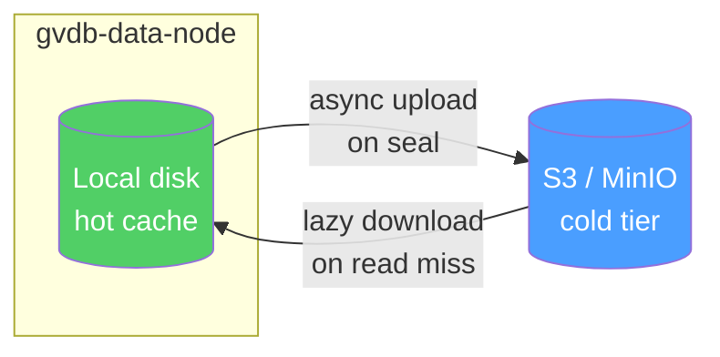

# Tiered storage (S3 / MinIO)

Offload sealed segments to object storage automatically. Hot data stays on local disk; cold segments live in S3 or MinIO with on-demand download.

## Why

- **Unbounded capacity**: store far more vectors than will fit on local disks
- **Lower cost**: object storage is ~10× cheaper per GB than SSD
- **Durability**: S3's 11-nines durability backs your most critical data

## Architecture



- `TieredSegmentManager` composes the local `SegmentManager` + `IObjectStore` + an LRU `SegmentCache`.
- **Sealed** segments upload asynchronously after local flush.
- **Reads** hit local disk first; on miss, the segment downloads to the cache.
- A **manifest** in the bucket lists every segment for fast startup discovery (no `ListObjects` scan).

## Enable at build time

S3 support is behind a CMake flag:

```bash
make build CMAKE_EXTRA="-DGVDB_WITH_S3=ON"
```

Runtime deps: `libssl-dev`, `libcurl4-openssl-dev`. The prebuilt Docker image includes them.

## Server configuration

Object store settings live under `storage` in the server YAML. An empty `object_store_type` disables tiered storage:

```yaml
storage:
  data_dir: "/var/lib/gvdb"

  object_store_type: "s3"                 # "s3" or "minio"
  object_store_endpoint: "https://s3.amazonaws.com"
  object_store_region: "us-east-1"
  object_store_bucket: "gvdb-cold"
  object_store_prefix: "segments/"
  object_store_access_key: "..."
  object_store_secret_key: "..."
  object_store_use_ssl: true
  object_store_cache_size_mb: 50000       # 50 GB
  object_store_upload_threads: 4
```

!!! warning "Not a Helm value"
    The Helm chart does not expose `storage.object_store_*` as values. Mount a custom ConfigMap / Secret with these fields set, overriding the chart-rendered config. Credentials should come from a Kubernetes Secret.

## MinIO locally

For testing, run MinIO via Docker Compose:

```bash
docker compose -f test/integration/docker-compose.minio.yml up -d
```

Then set `object_store_type: minio` and `object_store_endpoint: http://localhost:9000`.

Run the S3 integration tests:

```bash
make test-s3
```

## Cache behaviour

The local cache is an **LRU** with a configurable size. On miss, GVDB blocks until the segment is downloaded, then serves reads from the cached copy.

Evictions are background; in-flight queries are never interrupted.

## See also

- [Configuration](../operations/configuration.md) — full YAML schema
- [Deploy with Helm](../operations/deploy-helm.md)
