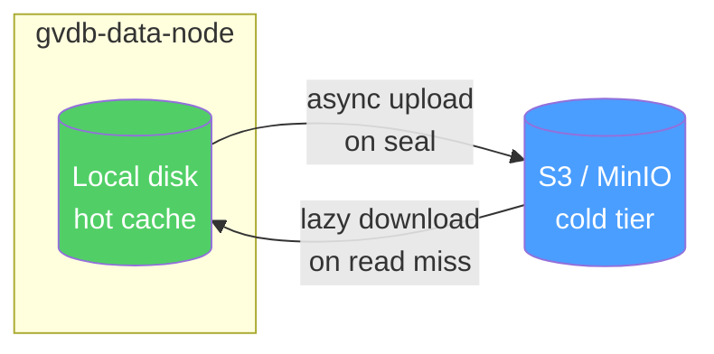

# Tiered storage

Offload sealed segments to an object store automatically. Hot data stays on local disk; cold segments live in the object store with on-demand download.

## Backends

| Backend | Build flag | When to use |
|---------|-----------|-------------|
| **S3** | `-DGVDB_WITH_S3=ON` | AWS S3, production |
| **MinIO** | `-DGVDB_WITH_S3=ON` | Self-hosted S3-compatible storage |
| **GCS** | `-DGVDB_WITH_GCS=ON` | Google Cloud Storage, GKE with Workload Identity |
| **Filesystem** | always on | Dev, CI, single-node, NFS-mounted cold tier |

All backends implement the same `IObjectStore` interface and are exercised by a shared contract test suite, so the same tiered-storage behavior holds regardless of which one you pick.

## Why

- **Unbounded capacity**: store far more vectors than will fit on local disks
- **Lower cost**: object storage is ~10× cheaper per GB than SSD
- **Durability**: S3's 11-nines durability backs your most critical data; the Filesystem backend uses `fsync` on both the temp file and the parent directory so writes survive power loss

## Architecture


```mermaid
graph LR
    subgraph DN[gvdb-data-node]
        direction TB
        Local[(Local disk<br/>hot cache)]
    end

    Object[(S3 / MinIO<br/>cold tier)]

    Local -- "async upload<br/>on seal" --> Object
    Object -- "lazy download<br/>on read miss" --> Local

    style Local fill:#51cf66,color:#fff
    style Object fill:#4a9eff,color:#fff
```

- `TieredSegmentManager` composes the local `SegmentManager` + `IObjectStore` + an LRU `SegmentCache`.
- **Sealed** segments upload asynchronously after local flush.
- **Reads** hit local disk first; on miss, the segment downloads to the cache.
- A **manifest** in the bucket lists every segment for fast startup discovery (no `ListObjects` scan).

## Enable at build time

Cloud backends are behind CMake flags:

```bash
# S3 / MinIO — AWS SDK is fetched from source
make build CMAKE_EXTRA="-DGVDB_WITH_S3=ON"

# GCS — google-cloud-cpp (storage) must be provided via find_package
# (vcpkg feature "storage", a system package, or a source install)
make build CMAKE_EXTRA="-DGVDB_WITH_GCS=ON"
```

S3 runtime deps: `libssl-dev`, `libcurl4-openssl-dev`. Both flags can be enabled together. The Filesystem backend is always available and needs no flag.

## Server configuration

Object store settings live in a nested `object_store` block under `storage` in the server YAML. Omitting the block (or leaving `type` empty with no endpoint) disables tiered storage.

=== "S3 / MinIO"

    ```yaml
    storage:
      data_dir: "/var/lib/gvdb"

      object_store:
        type: "s3"                        # "s3" or "minio"
        endpoint: "https://s3.amazonaws.com"
        region: "us-east-1"
        bucket: "gvdb-cold"
        prefix: "segments"
        access_key: "..."
        secret_key: "..."
        use_ssl: true
        local_cache_size_mb: 50000        # 50 GB
        upload_threads: 4
    ```

=== "GCS"

    ```yaml
    storage:
      data_dir: "/var/lib/gvdb"

      object_store:
        type: "gcs"
        bucket: "gvdb-cold"
        prefix: "segments"
        # Auth is Application Default Credentials. On GKE, bind a Google
        # service account via Workload Identity and leave these empty. For
        # local/dev, set credentials_path (or GOOGLE_APPLICATION_CREDENTIALS)
        # to a service-account JSON.
        project: ""                       # optional; ADC usually supplies it
        credentials_path: ""              # optional service-account JSON
        local_cache_size_mb: 50000
        upload_threads: 4
    ```

    No access/secret keys and no region: GCS auth is identity-based (Workload
    Identity on GKE) and a bucket's location is a property of the bucket. Set
    `endpoint` only to target a local fake-gcs-server emulator.

=== "Filesystem"

    ```yaml
    storage:
      data_dir: "/var/lib/gvdb"

      object_store:
        type: "filesystem"
        bucket: "/mnt/gvdb-cold"          # absolute root directory
        prefix: "segments"
        local_cache_size_mb: 50000
        upload_threads: 4
    ```

    The `bucket` field is interpreted as the root directory. The backend reserves a `.gvdb-tmp/` subdirectory for atomic writes; do **not** put application data there. Use this for dev, CI, single-node deployments, and NFS-mounted cold tiers where standing up MinIO would be overkill.

## Enable via Helm

The chart renders the `storage.object_store` block from the `objectStore` values section and starts the config-consuming workloads with `--config`:

```yaml
objectStore:
  enabled: true
  type: s3                 # "s3" | "minio" | "gcs"
  endpoint: http://minio.storage.svc.cluster.local:9000
  bucket: gvdb-segments
  region: us-east-1
  prefix: gvdb
  useSsl: false            # plain-HTTP MinIO
  cacheSizeMb: 256
  uploadThreads: 2
```

!!! warning "Static credentials are for dev only"
    `objectStore.accessKey` / `objectStore.secretKey` render into the ConfigMap the pods read. Use them only for dev/MinIO. In production leave both empty and grant bucket access via IRSA (EKS) or Workload Identity (GKE), or mount your own config Secret.

## MinIO locally

For testing, run MinIO via Docker Compose:

```bash
docker compose -f test/integration/docker-compose.minio.yml up -d
```

Then set `object_store_type: minio` and `object_store_endpoint: http://localhost:9000`.

Run the S3 integration tests:

```bash
make test-s3
```

## fake-gcs-server locally

For GCS testing without a real bucket, run the fake-gcs-server emulator:

```bash
docker compose -f test/integration/docker-compose.fake-gcs.yml up -d
```

Then set `object_store_type: gcs`, `object_store_bucket: gvdb-test`, and
`object_store_endpoint: http://localhost:4443`. The Go e2e (`gcs_storage.go`)
runs when `GVDB_GCS_ENDPOINT` is set:

```bash
GVDB_GCS_ENDPOINT=http://localhost:4443 ./test/e2e/run_all_tests.sh
```

## Cache behaviour

The local cache is an **LRU** with a configurable size. On miss, GVDB blocks until the segment is downloaded, then serves reads from the cached copy.

Evictions are background; in-flight queries are never interrupted.

## See also

- [Configuration](../operations/configuration.md) — full YAML schema
- [Deploy with Helm](../operations/deploy-helm.md)
