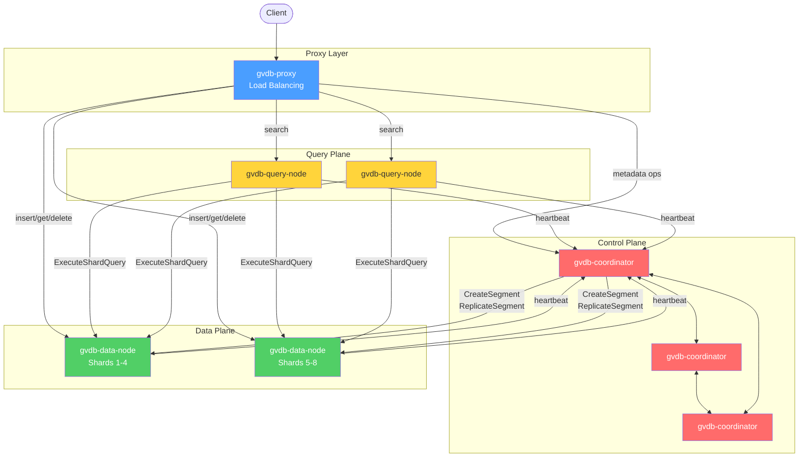

# GVDB

**A high-performance distributed vector database written in C++ for similarity search at scale.**

Store, index, and search high-dimensional vectors — embeddings from OpenAI, Cohere, HuggingFace, and any other model — with sub-millisecond latency. Use GVDB to power semantic search, recommendation engines, RAG pipelines, image retrieval, and anomaly detection.

<div class="grid cards" markdown>

- :material-rocket-launch: **Install & run in 5 minutes**

    ---

    Spin up a single-node server, insert your first vectors, and run a search.

    [:octicons-arrow-right-24: Quickstart](getting-started/quickstart.md)

- :material-server-network: **Deploy to Kubernetes**

    ---

    Production-ready Helm chart with sharding, replication, and tiered storage.

    [:octicons-arrow-right-24: Distributed cluster](getting-started/distributed-cluster.md)

- :material-language-python: **Use the Python SDK**

    ---

    `pip install gvdb` and you're done. Full CRUD, hybrid search, bulk import.

    [:octicons-arrow-right-24: Python SDK](python-sdk/index.md)

- :material-sync: **Stream from Spark & Flink**

    ---

    Java connectors for batch and streaming pipelines. Maven Central.

    [:octicons-arrow-right-24: Connectors](connectors/spark.md)

</div>

## Why GVDB

- **[Vector search](features/vector-search.md)** — FLAT, HNSW, IVF_FLAT, IVF_PQ, IVF_SQ, TurboQuant, IVF_TURBOQUANT index types with `AUTO` selection
- **[Sparse vectors](features/sparse-vectors.md)** — Inverted posting-list index for learned sparse retrieval (SPLADE, etc.)
- **[TurboQuant](features/turboquant.md)** — Data-oblivious online quantization (ICLR 2026). 1/2/4/8-bit compression with near-optimal distortion; 7.5× at 4-bit on 768D
- **[Three-way hybrid search](features/hybrid-search.md)** — Dense vectors + sparse vectors + BM25 text with Reciprocal Rank Fusion
- **[Per-vector TTL](features/ttl.md)** — Time-to-live with background sweep and query-time expiry filtering
- **[Distributed mode](getting-started/distributed-cluster.md)** — Coordinator, data nodes, query nodes, proxy; full sharding and replication
- **[RBAC](features/rbac.md)** — Role-based access control with per-collection scoping and YAML config
- **[Tiered storage](features/tiered-storage.md)** — Sealed segments uploaded to S3/MinIO; LRU local cache, lazy download
- **[GPU acceleration](features/gpu-acceleration.md)** — Apple Metal kernels deliver 16–24× speedup over CPU on Apple Silicon
- **[Python SDK](python-sdk/index.md)** — Full API with hybrid search, streaming inserts, metadata, TTL, bulk import from Parquet/NumPy/pandas/h5ad

## Architecture



## 30-second quickstart

=== "Python"

    ```bash
    pip install gvdb
    ```

    ```python
    from gvdb import GVDBClient

    client = GVDBClient("localhost:50051")
    client.create_collection("vectors", dimension=768)
    client.insert("vectors", ids=[1, 2], vectors=[[0.1]*768, [0.2]*768])

    results = client.search("vectors", query_vector=[0.1]*768, top_k=10)
    for r in results:
        print(r.id, r.distance)
    ```

=== "Helm"

    ```bash
    helm install gvdb oci://ghcr.io/jonathanberhe/charts/gvdb \
      --namespace gvdb --create-namespace

    kubectl port-forward -n gvdb svc/gvdb-proxy 50050:50050
    ```

=== "Docker (single-node)"

    ```bash
    docker run -p 50051:50051 \
      -v /tmp/gvdb:/var/lib/gvdb \
      ghcr.io/jonathanberhe/gvdb:latest \
      gvdb-single-node --port 50051 --data-dir /var/lib/gvdb
    ```

## License

Apache License 2.0. GVDB is open source and free to use in commercial projects. See [LICENSE](https://github.com/JonathanBerhe/gvdb/blob/main/LICENSE).
