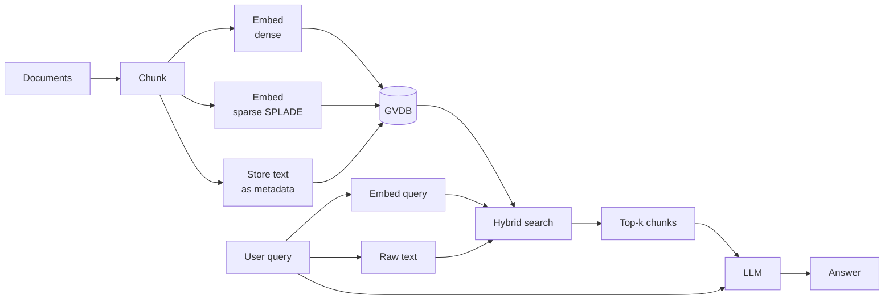

# Retrieval-Augmented Generation (RAG)

GVDB is a natural fit for RAG: store your document chunks as dense embeddings, optionally add sparse vectors for lexical coverage, and combine both with BM25 text search in a single hybrid query.

## Anatomy of a RAG pipeline



## Ingestion

```python
from gvdb import GVDBClient

client = GVDBClient("localhost:50051")

client.create_collection("docs", dimension=768, metric="cosine")

# For each chunk: dense embedding + sparse SPLADE + original text as metadata
client.insert(
    "docs",
    ids=[1, 2, 3],
    vectors=[dense_emb_1, dense_emb_2, dense_emb_3],
    sparse_vectors=[                         # dict[int, float] — no custom class
        sparse_splade_1,
        sparse_splade_2,
        sparse_splade_3,
    ],
    metadata=[
        {"text": "Chunk 1 content...", "source": "doc_a.pdf", "page": 1},
        {"text": "Chunk 2 content...", "source": "doc_a.pdf", "page": 2},
        {"text": "Chunk 3 content...", "source": "doc_b.pdf", "page": 1},
    ],
)
```

See [sparse vectors](../features/sparse-vectors.md) for how SPLADE-style dicts work.

## Retrieval

Three-way hybrid (dense + sparse + BM25) typically wins:

```python
def retrieve(query: str, query_dense, query_sparse: dict[int, float], k: int = 5):
    results = client.hybrid_search(
        "docs",
        query_vector=query_dense,
        sparse_query=query_sparse,
        text_query=query,
        text_field="text",
        top_k=k,
        vector_weight=0.5,
        text_weight=0.2,
        sparse_weight=0.3,
        return_metadata=True,
    )
    return [r.metadata["text"] for r in results]
```

## Generation

```python
def answer(query: str, query_dense, query_sparse: dict[int, float]) -> str:
    context_chunks = retrieve(query, query_dense, query_sparse, k=5)
    context = "\n\n".join(context_chunks)

    prompt = f"""Answer the question using only the context below.

Context:
{context}

Question: {query}
Answer:"""

    return llm.complete(prompt)
```

## Tips

- **Chunk size**: 200–500 tokens works well for most embedders. Store overlap (~15%) to avoid splitting mid-answer.
- **Metadata filters**: combine with the user's session, tenant, or recency for multi-tenant RAG:

  ```python
  filter_expression="tenant_id = 'acme' AND created_at > 1700000000"
  ```
- **Rerankers**: the fused top-k from hybrid search is often reranker-ready; feed it to a cross-encoder for the final top-3.

## See also

- [Hybrid search](../features/hybrid-search.md)
- [Sparse vectors](../features/sparse-vectors.md)
- [Python SDK — client](../python-sdk/client.md)
